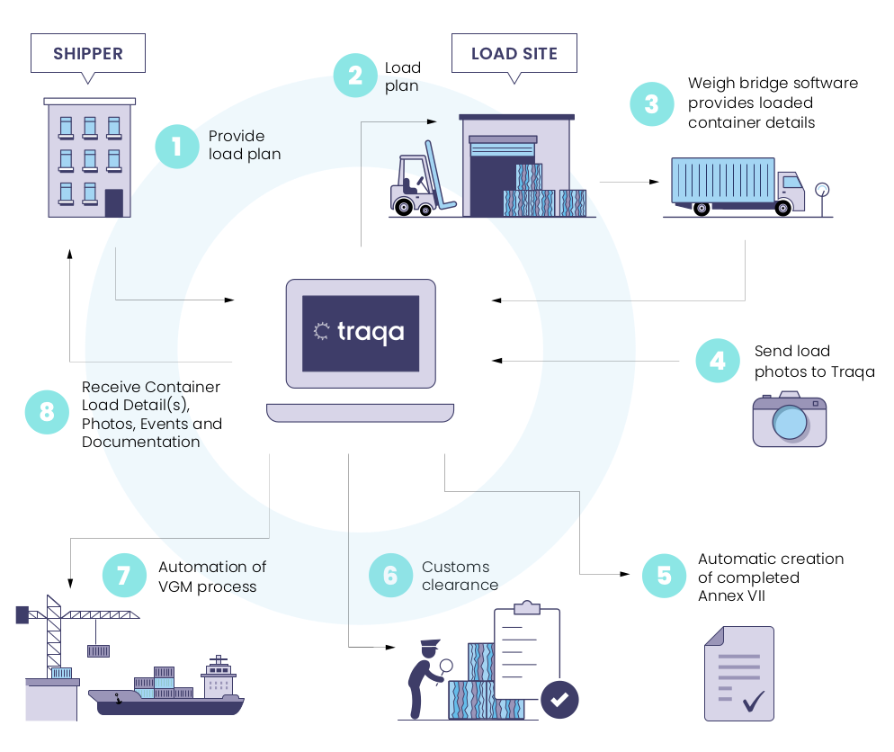

# Introduction 

Traqa is a collaborative platform that automates the transfer of information between all parties in the recycling supply chain, ensuring regulatory compliance in an increasingly digital regulatory system boasting huge benefits of automation which saving time and money on regulatory burden.
The aim of this documentation is to explain how it works and provide a step by step guide of the specific use cases for integrating to the API. Below is a diagram detailing out an overview of steps that take place during the Traqa Process. These steps break down into API integrations depending on your use case.

## Process Flow

!!! info "SOME NOTE"

    The following Diagram explains at a high level the flow of data and how Traqa fits in to the process. There will be a more detailed break down of what this means for you as we proceed. Determining what this means for you is decided by which role your play in this process, either Shipper or Loading Site. Your interaction and responsibility with Traqa will differ depending upon the Role that you act as in the process flow.

